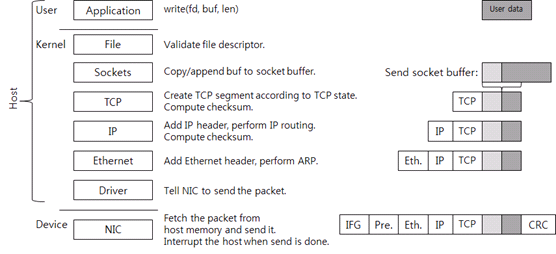
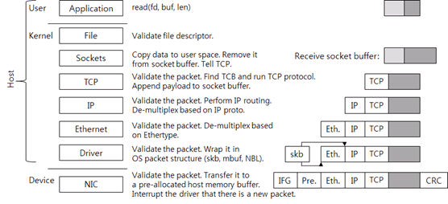
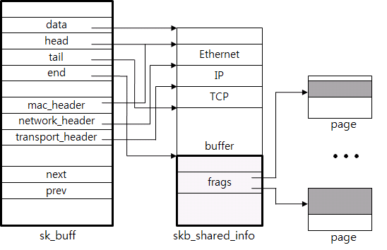
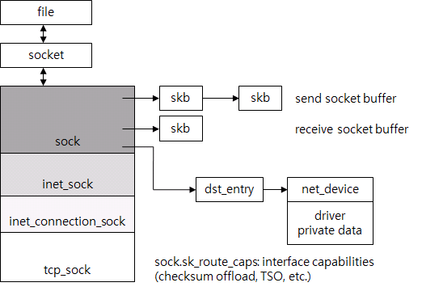
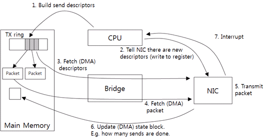

## TCP/IP 네트워크 스택 이해하기

[**TCP/IP 네트워크 스택 이해하기**](https://d2.naver.com/helloworld/47667)

### 데이터 전송

유저 영역부터 밑으로 내려가 보자. 우선 애플리케이션이 전송할 데이터를 생성하고(그림 1에서 User data 상자), write 시스템 콜을 호출해서 데이터를 보낸다. 소켓(그림 2에서 fd)은 이미 생성되어 연결되어 있다고 가정한다. 시스템 콜을 호출하면 커널 영역으로 전환된다.

Linux나 Unix를 포함한 POSIX 계열 운영체제는 소켓을 file descriptor로 애플리케이션에 노출한다. 이런 POSIX 계열의 운영체제에서 소켓은 파일의 한 종류다. 파일(file) 레이어는 단순한 검사만 하고 파일 구조체에 연결된 소켓 구조체를 사용해서 소켓 함수를 호출한다.

커널 소켓은 두 개의 버퍼를 가지고 있다. 송신용으로 준비한 send socket buffer, 수신용으로 준비한 receive socket buffer이다. Write 시스템 콜을 호출하면 유저 영역의 데이터가 커널 메모리로 복사되고, send socket buffer의 뒷부분에 추가된다. 순서대로 전송하기 위해서다. 그림에서 옅은 회식 상자가 이미 socket buffer에 존재하는 데이터를 의미한다. 이 다음으로 TCP를 호출한다.

소켓과 연결된 TCP Control Block(TCB) 구조체가 있다. TCB에는 TCP 연결 처리에 필요한 정보가 있다. TCB에 있는 데이터는 connection state(LISTEN, ESTABLISHED, TIME_WAIT 등), receive window, congestion window, sequence 번호, 재전송 타이머 등이다.

현재 TCP 상태가 데이터 전송을 허용하면 새로운 TCP segment, 즉 패킷을 생성한다. Flow control 같은 이유로 데이터 전송이 불가능하면 시스템 콜은 여기서 끝나고, 유저 모드로 돌아간다(즉, 애플리케이션으로 제어권이 넘어간다).

TCP segment에는 TCP 헤더와 페이로드(payload)가 있다. 페이로드에는 ACK를 받지 않은 send socket buffer에 있는 데이터가 담겨 있다. 페이로드의 최대 길이는 receive window, congestion window, MSS(Maximum Segment Size) 중 최대 값이다.

그리고 TCP checksum을 계산한다. 이 checksum 계산에는 pseudo 헤더 정보(IP 주소들, segment 길이, 프로토콜 번호)를 포함시킨다. 여기서 TCP 상태에 따라 패킷을 한 개 이상 전송할 수 있다.

사실 요즘의 네트워크 스택에서는 checksum offload 기술을 사용하기 때문에, 커널이 직접 TCP checksum을 계산하지 않고 대신 NIC가 checksum을 계산한다. 여기서는 설명의 편의를 위해 커널이 checksum을 계산한다고 가정한다.

생성된 TCP segment는 IP 레이어로 이동한다(내려 간다). IP 레이어에서는 TCP segment에 IP 헤더를 추가하고, IP routing을 한다. IP routing이란 목적지 IP 주소(destination IP)로 가기 위한 다음 장비의 IP 주소(next hop IP)를 찾는 과정을 말한다.

IP 레이어에서 IP 헤더 checksum을 계산하여 덧붙인 후, Ethernet 레이어로 데이터를 보낸다.

Ethernet 레이어는 ARP(Address Resolution Protocol)를 사용해서 next hop IP의 MAC 주소를 찾는다. 그리고 Ethernet 헤더를 패킷에 추가한다. Ethernet 헤더까지 붙으면 호스트의 패킷은 완성이다.

IP routing을 하면 그 결과물로 next hop IP와 해당 IP로 패킷 전송할 때 사용하는 인터페이스(transmit interface, 혹은 NIC)를 알게 된다. 따라서 transmit NIC의 드라이버를 호출한다.

만약 [tcpdump](http://www.tcpdump.org/)나 [Wireshark](http://www.wireshark.org/) 같은 패킷 캡처 프로그램이 작동 중이면 커널은 패킷 데이터를 프로그램이 사용하는 메모리 버퍼에 복사한다. 수신도 마찬가지로 드라이버 바로 위에서 패킷을 캡처한다. 대개 traffic shaper 기능도 이 레이어에서 동작하도록 구현되어있다.

드라이버는 NIC 제조사가 정의한 드라이버-NIC 통신 규약에 따라 패킷 전송을 요청한다.

NIC는 패킷 전송 요청을 받고, 메인 메모리에 있는 패킷을 자신의 메모리로 복사하고, 네트워크 선으로 전송한다. 이때 Ethernet 표준에 따라 IFG(Inter-Frame Gap), preamble, 그리고 CRC를 패킷에 추가한다. IFG, preamble은 패킷의 시작을 판단하기 위해 사용하고(네트워킹 용어로는 framing), CRC는 데이터 보호를 위해 사용한다(TCP, IP checksum과 같은 용도이다). 패킷 전송은 Ethernet의 물리적 속도, 그리고 Ethernet flow control에 따라 전송할 수 있는 상황일 때 시작된다. 회의장에서 발언권을 얻고 말하는 것과 비슷하다.

NIC가 패킷을 전송할 때 NIC는 호스트 CPU에 인터럽트(interrupt)를 발생시킨다. 모든 인터럽트에는 인터럽트 번호가 있으며, 운영체제는 이 번호를 이용하여 이 인터럽트를 처리할 수 있는 적합한 드라이버를 찾는다. 드라이버는 인터럽트를 처리할 수 있는 함수(인터럽트 핸들러)를 드라이브가 가동되었을 때 운영체제에 등록해둔다. 운영체제가 핸들러를 호출하고, 핸들러는 전송된 패킷을 운영체제에 반환한다.

지금까지 설명한 것은 애플리케이션에서 쓰기를 하였을 때 데이터가 커널과 디바이스를 거쳐 전송되는 과정이다. 그런데 애플리케이션이 쓰기 요청을 직접적으로 하지 않아도 커널이 TCP를 호출해서 패킷을 전송하는 경우가 있다. 예를 들어 ACK을 받아 receive window가 늘어나면 socket buffer에 남아있는 데이터를 포함한 TCP segment를 생성하여 상대편에 전송한다.

### 데이터 수신

우선 NIC가 패킷을 자신의 메모리에 기록한다. CRC 검사로 패킷이 올바른지 검사하고, 호스트의 메모리버퍼로 전송한다. 이 버퍼는 드라이버가 커널에 요청하여 패킷 수신용으로 미리 할당한 메모리이고, 할당을 받은 후 드라이버는 NIC에 메모리 주소와 크기를 알려 준다. NIC가 패킷을 받았는데, 드라이버가 미리 할당해 놓은 호스트 메모리 버퍼가 없으면 NIC가 패킷을 버릴 수 있다 (packet drop).

패킷을 호스트 메모리로 전송한 후, NIC가 호스트운영체제에 인터럽트를 보낸다.

드라이버가 새로운 패킷을 보고 자신이 처리할 수 있는 패킷인지 검사한다. 여기까지는 제조사가 정의한 드라이버-NIC 통신 규약을 사용한다.

드라이버가 상위 레이어로 패킷을 전달하려면 운영체제가 이해할 수 있도록, 받은 패킷을 운영체제가 사용하는 패킷 구조체로 포장해야 한다. 예를 들어, Linux의 sk_buff, BSD 계열 커널의 mbuf, 그리고 Microsoft Windows의 NET_BUFFER_LIST가 운영체제의 패킷 구조체이다. 드라이버는 이렇게 포장한 패킷을 상위 레이어로 전달한다.

애플리케이션이 read 시스템 콜을 호출하면 커널 영역으로 전환되고, socket buffer에 있는 데이터를 유저 공간의 메모리로 복사해 간다. 복사한 데이터는 socket buffer에서 제거한다. 그리고 TCP를 호출한다. TCP는 socket buffer에 새로운 공간이 생겼기 때문에 receive window를 증가시킨다. 그리고 프로토콜 상태에 따라 패킷을 전송한다. 패킷 전송이 없으면 시스템 콜이 종료된다.

### TCP control block

file만 찾으면 TCP 연결을 처리하는데 필요한 모든 구조체(file부터 드라이버까지)를 포인터로 쉽게 찾을 수 있다.

### 드라이버와 NIC의 통신
드라이버와 NIC는 비동기 방식으로 통신한다. 먼저 드라이버가 패킷 전송을 요청하고(호출), CPU는 응답을 기다리지 않고 다른 작업을 수행한다. 이후 NIC가 패킷을 전송하고 CPU에 이 사실을 알리면 드라이버가 전송된 패킷을 반환한다(결과 리턴). 수신도 이와 같이 비동기 방식으로 이루어진다. 먼저 드라이버가 수신 요청을 하고 CPU는 다른 작업을 수행한다(호출). 이후 NIC가 패킷을 받으면 CPU에 이 사실을 알리고, 드라이버가 받은 패킷을 처리한다(결과 리턴).

드라이버가 상위 레이어로부터 패킷을 받고, NIC가 이해하는 전송 요청(send descriptor)을 생성한다. send descriptor에는 기본적으로 패킷 크기, 메모리 주소를 포함하도록 한다. NIC는 메모리에 접근할 때 필요한 물리적 주소가 필요하다, 따라서 드라이버가 패킷의 가상 주소를 물리적 주소로 변경한다. 그리고 send descriptor를 TX ring에 추가한다(1). TX ring이 전송 요청 링이다.

그리고 NIC에 새로운 요청이 있다고 알린다(2). 특정 NIC 메모리 주소에 드라이버가 직접 데이터를 쓴다. 이와 같이 CPU가 디바이스에 직접 데이터를 전송하는 방식을 PIO(Programmed I/O)라고 한다.

연락을 받은 NIC는 TX ring의 send descriptor를 호스트 메모리에서 가져온다(3). CPU의 개입 없이 디바이스가 직접 메모리에 접근하기 때문에, 이와 같은 접근을 DMA(Direct Memory Access)라고 부른다.

Send descriptor를 가져와서 패킷 주소와 크기를 판단하고, 실제 패킷을 호스트 메모리에서 가져온다(4). Checksum offload 방식을 사용하면 메모리에서 패킷 데이터를 가져올 때 checksum을 NIC가 계산하도록 한다. 따라서 오버헤드는 거의 발생하지 않는다.

NIC가 패킷을 전송하고(5), 패킷을 몇 개 전송했는지 호스트의 메모리에 기록한다(6). 그리고 인터럽트를 보낸다(7). 드라이버는 전송된 패킷 수를 읽어 와서 현재까지 전송된 패킷을 반환한다.

> **스택 튜닝**이라고 하면 흔히 ring, interrupt 설정을 조절해야 한다고 이야기한다. TX ring이 크면 한 번에 많은 수의 전송 요청을 할 수 있다. RX ring이 크면 한 번에 많은 수의 수신을 할 수 있다. 패킷 송신, 수신 burst가 많은 워크로드에는 큰 링이 도움이 된다. 그리고 CPU가 인터럽트를 처리하는 오버헤드가 크기 때문에, 대개 NIC은 인터럽트 회수를 줄이기 위해 타이머를 사용한다. 패킷을 전송하고 수신할 때 매번 인터럽트를 보내지 않고 주기적으로 모아서 보낸다(interrupt coalescing).