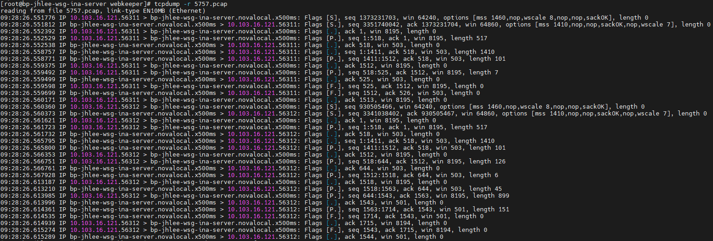
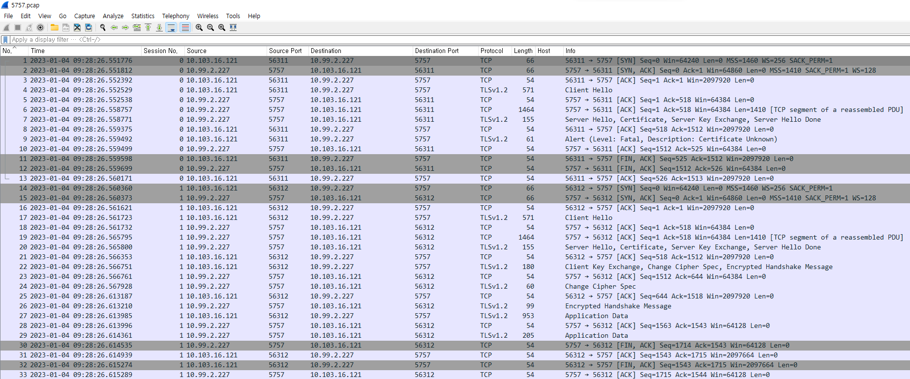

# Tips

- [Tips](#tips)
  - [\[c++\] 문자열 파싱 방법](#c-문자열-파싱-방법)
  - [\[git\] submodule이란? submodule의 merge request 절차는?](#git-submodule이란-submodule의-merge-request-절차는)
  - [\[linux\] tcpreplay 사용 시, unable to send packet: message too long 메시지가 발생할 때 해결 방법](#linux-tcpreplay-사용-시-unable-to-send-packet-message-too-long-메시지가-발생할-때-해결-방법)
  - [\[linux\] tmux 사용 방법 정리](#linux-tmux-사용-방법-정리)
  - [\[word\] 집요함이 결과를 만들어낸다.](#word-집요함이-결과를-만들어낸다)
  - [\[linux\] rpm과 yum](#linux-rpm과-yum)
  - [\[linux\] google/sanitizes 를 이용한 동적 메모리 에러 취약점 방어](#linux-googlesanitizes-를-이용한-동적-메모리-에러-취약점-방어)
  - [\[c++\] boost::make\_iterator\_range()를 활용하여 range 객체화하기](#c-boostmake_iterator_range를-활용하여-range-객체화하기)
  - [\[c++\] 템플릿 클래스를 정의할 때 선언부와 구현부를 서로 다른 파일로 분리하는 방법](#c-템플릿-클래스를-정의할-때-선언부와-구현부를-서로-다른-파일로-분리하는-방법)
  - [\[c++\] ODR(One Definition Rule)이란?](#c-odrone-definition-rule이란)
  - [\[c++\] async의 콜백 함수로 클래스의 멤버 함수를 사용하는 경우 주의 사항](#c-async의-콜백-함수로-클래스의-멤버-함수를-사용하는-경우-주의-사항)
  - [\[c++\] dynamic cast 사용 시 주의 사항](#c-dynamic-cast-사용-시-주의-사항)
  - [\[c++\] 리팩토링 후기](#c-리팩토링-후기)
  - [\[c++\] 클래스 전방 선언 완벽 정리](#c-클래스-전방-선언-완벽-정리)
  - [\[git\] git commit 메시지에 템플릿 적용하는 방법](#git-git-commit-메시지에-템플릿-적용하는-방법)
  - [\[네트워크\] tcpdump로 실시간 패킷 흐름 확인하기](#네트워크-tcpdump로-실시간-패킷-흐름-확인하기)
  - [\[linux\] 사설인증서 만들기(서버, 클라이언트)](#linux-사설인증서-만들기서버-클라이언트)

<br>

## [c++] 문자열 파싱 방법
전체 문자열 중 일부가 target 문자열에 매칭되는지 여부를 확인하기 위한 과정 중에 추출된 부분 문자열에 대하여 openssl 라이브러리에서 제공하는 MD5 함수를 호출해야하는 작업이 필요했습니다. 아래 [MD5 함수의 정의](https://www.openssl.org/docs/man1.1.1/man3/MD5.html)를 살펴보면 md5 message digest를 생성할 대상의 시작 지점을 가리키는 포인터(d)와 해당 시작 지점에서부터 얼마나 떨어져 있는지를 나타내는 길이(n), 그리고 생성된 md5 message digest를 저장할 공간을 가리키는 포인터(md)를 함수의 인자로 받고있는 것을 확인할 수 있습니다.
```cpp
// MD5 message digest of the n bytes at d and place it in md
unsigned char *MD5(const unsigned char *d, unsigned long n, unsigned char *md);
```

이처럼 원본 문자열을 변형시키거나 부분 문자열을 위한 임시 공간을 생성하지 않으면서 파싱하는 방법이 있다는 것을 기억해 두면 유용할 것입니다.

<br>

## [git] submodule이란? submodule의 merge request 절차는?
[git 공식 홈페이지](https://git-scm.com/docs/gitsubmodules)에서는 submodule을 아래와 같이 설명하고 있습니다.
submodule은 다른 저장소안에 내장된 저장소입니다. submodule은 자체적인 변경 이력을 가지고 있고, submodule이 포함된 저장소를 superproject라고 합니다.
> A submodule is a repository embedded inside another repository. The submodule has its own history; the repository it is embedded in is called a superproject.

submodule을 포함하는 프로젝트에서 submodule을 수정해야 할 일이 생겼다면..? 수정을 완료한 뒤 merge 요청은 수정한 submodule부터 merge를 완료하고 난 뒤에 해당 submodule을 포함하고 있는 프로젝트에 merge 요청을 수행합니다. 이때 해당 프로젝트의 수정 사항이 submodule뿐이라면 수정한 submodule의 commit 정보만 변경 사항으로 잡힐 것입니다.

<br>

## [linux] tcpreplay 사용 시, unable to send packet: message too long 메시지가 발생할 때 해결 방법
tcpreplay라는 툴을 사용하여 지정된 nic에 특정 패킷을 흘려보내고자 할 때, message too long이라는 에러 메시지가 발생하는 경우에는 MTU(Maximum Transmission Unit) 사이즈를 변경하는 것이 해결책이 될 수 있습니다.
```
sudo ifconfig eth0 mtu 2000
```

<br>

## [linux] tmux 사용 방법 정리
블로그 게시글 참조
* https://chelseafandev.github.io/2021/07/22/tip-how-to-use-tmux-md/

<br>

## [word] 집요함이 결과를 만들어낸다.
집요하게 파고 들어서 생각하다보면 좋은 결과를 도출해낼 때가 많다. 계속해서 왜(Why)를 생각하면서 하나씩 파고 들어보자. 집요하게 반복하는 왜(Why)를 통해서 결과가 도출된 과정이 보인다.

<br>

## [linux] rpm과 yum
* rpm: .rpm 파일을 사용하여 직접 패키지를 설치하기 위한 명령어입니다. 의존성을 갖는 패키지의 경우에는 의존 관계에 맞게 순서대로 패키지를 설치해야하는 번거로움이 있습니다.
* yum: yum은 기본적으로 yum repository로 지정된 저장소에 접근하여 원하는 패키지를 설치할 수 있도록 해주는 명령어 입니다. 의존 패키지까지 자동으로 설치해주기 때문에 매우 편리합니다.
* yum repository: rpm들이 보관되는 저장소입니다. yum을 통한 패키지 설치는 이 저장소에 저장된 rpm을 기준으로 수행됩니다.
  * RPMS/ : 바이너리 RPM에는 소스 및 패치에서 빌드된 바이너리가 포함되어 있습니다.
  * SRPMS/ : SRPM에는 소스 코드와 SPEC 파일이 포함되어 있으며, 바이너리 RPM에 소스 코드를 빌드하는 방법을 설명합니다. 선택적으로 소스 코드에 대한 패치도 포함됩니다.
  * repodata/ : repository에 대한 meta 데이터들이 포함되어 있습니다.
  * RPM-GPG-KEY : 제공하는 패키지에 대한 유효성 검증을 위해 사용되는 공개키 정보입니다.

RPMS/ 디렉토리에 존재하는 rpm들을 yum을 통해 설치하는 경우에는 rpm 파일명에서 해당 패키지의 버전 정보 이전까지의 명칭을 사용하면 됩니다. 예를 들어, rpm 파일명이 `nodejs-6.14.3-1.el7.x86_64.rpm`이라고 한다면 설치 명령어는 아래와 같습니다.
```
yum install nodejs
```

(참고사항1) `el7`의 의미는?
**EL** is short for Red Hat **E**nterprise **L**inux (EL).
* EL6 is the download for Red Hat 6.x, CentOS 6.x, and CloudLinux 6.x.
* EL5 is the download for Red Hat 5.x, CentOS 5.x, CloudLinux 5.x.
* EL7 is the download for Red Hat 7.x, CentOS 7.x, and CloudLinux 7.x.

(참고사항2) `x86_64`의 의미는?
아키텍쳐 종류를 의미합니다.

Red Hat 공식 홈페이지에서 [RPM 패키징 가이드](https://access.redhat.com/documentation/ko-kr/red_hat_enterprise_linux/7/html/rpm_packaging_guide/index)문서를 제공하고 있으니 참고바랍니다.

<br>

## [linux] google/sanitizes 를 이용한 동적 메모리 에러 취약점 방어
어떤 방식으로 메모리 취약점을 동적으로 점검할 수 있을까에 대한 궁금증을 해소하기 위해 [공식 Wiki](https://github.com/google/sanitizers/wiki)를 살펴보도록 하겠습니다.

<br>

## [c++] boost::make_iterator_range()를 활용하여 range 객체화하기
boost::iterator_range() 함수는 begin과 end iterator로부터 range 객체를 생성합니다. range 객체는 대게 begin()과 end()를 메소드 함수로 갖는 container로부터 생성되기 때문에 boost::iterator_range() 함수는 사용자 정의 iterator를 래핑(wrapping)하는데 유용하게 사용됩니다.
> iterator_range() creates a range object from a begin and end iterator. Since ranges are constructed implicitly from containers that have .begin() and .end() methods, it's mostly useful for wrapping custom iterators.

실제로는 template 타입을 자동으로 추론(deduce)해주는 boost::make_iterator_range() 함수를 사용하는 것이 조금 더 편리합니다.
> In practice, it's more convenient to use the make_iterator_range() function that deduces the template type automatically.

```cpp
#include <iostream>
#include <iterator>
#include <sstream>

#include <boost/range.hpp>

int main()
{
    std::stringstream ss("The quick brown fox jumps over the lazy dog.");
    auto begin = std::istream_iterator<std::string>(ss);
    auto end = std::istream_iterator<std::string>();

    // iterator_range
    auto range = boost::iterator_range<decltype(begin)>(begin, end);
    for (const auto & word : range) {
        std::cout << "[" << word << "] ";
    }
    std::cout << std::endl;

    // make_iterator_range 함수를 사용하는 경우에는 template type을 자동으로 추론(deduce)해준다.
    for (const auto & word : boost::make_iterator_range(begin, end)) {
        std::cout << "[" << word << "] ";
    }
    std::cout << std::endl;

    return 0;
}
```
```
[The] [quick] [brown] [fox] [jumps] [over] [the] [lazy] [dog.] 
[The] [quick] [brown] [fox] [jumps] [over] [the] [lazy] [dog.]
```

<br>

## [c++] 템플릿 클래스를 정의할 때 선언부와 구현부를 서로 다른 파일로 분리하는 방법
헤더 파일의 맨 하단에 템플릿 클래스를 구현한 파일을 include 시켜주면 된다. (#include는 대상이되는 파일을 단순히 붙여 넣어주는 역할을 하므로)
```cpp
#ifndef MYTEMPLATECLASS_H
#define MYTEMPLATECLASS_H

namespace ggultip
{
	template <typename T>
	class mytemplateclass
	{
	public:
		mytemplateclass();
		~mytemplateclass();
		
		...
	};
}

#endif

#include "mytemplateclass.impl.h"
```

```cpp
#pragma once

namespace ggultip
{
	template <typename T>
	mytemplateclass<T>::mytemplateclass()
	{
		...
	}
	
	template <typename T>
	mytemplateclass<T>::~mytemplateclass()
	{
		...
	}
	
	...
}
```

<br>

## [c++] ODR(One Definition Rule)이란?
* https://learn.microsoft.com/en-us/cpp/cpp/program-and-linkage-cpp?view=msvc-170
* https://modoocode.com/320

C++ 프로그램에서 변수나 함수의 이름와 같은 심볼은 그것들의 생명 주기가 유지되는 범위 내에서는 횟수에 관계없이 선언(declaration)될 수 있습니다. 하지만 오직 한번만 정의(definition) 될 수 있습니다. 이 규칙이 바로 "One Definition Rule(ODR)"입니다.
> In a C++ program, a symbol, for example a variable or function name, can be declared any number of times within its scope. However, it can only be defined once. This rule is the "One Definition Rule" (ODR).

프로그램은 하나 또는 그 이상의 해석 유닛(Translation Unit)으로 구성되어있습니다. 해석 유닛은 구현 파일과 그것에 직/간접적으로 포함된 모든 헤더 파일들로 이루어져있습니다. 보통 구현 파일들은 .cpp나 .cxx와 같은 파일 확장자를 갖습니다. 헤더 파일의 경우에는 .h 또는 .hpp를 파일 확장자로 갖습니다. 각각의 해석 유닛은 컴파일러에 의해 독립적으로 컴파일됩니다. 컴파일이 완료된 이후에, 링커는 컴파일된 해석 유닛들을 하나의 프로그램으로 합치는 역할을 수행합니다. ODR 규칙의 위반은 대게 링커 에러로 나타납니다. 이 링커 에러는 동일한 이름이 하나 이상의 해석 유닛에서 정의(definition)된 경우에 발생합니다.
> A program consists of one or more translation units. A translation unit consists of an implementation file and all the headers that it includes directly or indirectly. Implementation files typically have a file extension of .cpp or .cxx. Header files typically have an extension of .h or .hpp. Each translation unit is compiled independently by the compiler. After the compilation is complete, the linker merges the compiled translation units into a single program. Violations of the ODR rule typically show up as linker errors. Linker errors occur when the same name is defined in more than one translation unit.

각 TU 에 존재하는 모든 변수, 함수, 클래스, enum, 템플릿 등등의 정의(Definition) 은 유일 해야 하고 `inline` 이 아닌 모든 함수의 변수들의 정의는 전체 프로그램에서 유일해야 합니다.

<br>

## [c++] async의 콜백 함수로 클래스의 멤버 함수를 사용하는 경우 주의 사항
* https://stackoverflow.com/questions/57427740/how-to-pass-a-function-and-its-parameters-to-stdasync-inside-a-member-functio

std::async 함수의 인자로 반드시 `this`를 함께 넘겨주어야 합니다.

```cpp
#include <iostream>
#include <vector>
#include <string>
#include <future>

using namespace std;

class splitter
{
    public:
    splitter() = default;
    virtual ~splitter() = default;
    bool execute(vector<string> &vstr);
    bool split_files(vector<string> &vstr);
};

bool splitter::split_files(vector<string> &vstr)
{
    for(auto & file : vstr)
    {
        // do something
        cout << file << endl;
    }
    return true;
}

bool splitter::execute(vector<string> &vstr)
{
    // 3번째 인자로 this가 들어가야한다는 것에 주의 하자!
	auto fut = std::async(std::launch::async, &splitter::split_files, this, std::ref(vstr));
    bool good = fut.get();
    return good;
}

int main()
{
    vector<string> filenames {
                                "file1.txt",
                                "file2.txt",
                                "file3.txt"
                             };

    splitter split;
    split.execute(filenames);

    return 0;
}
```

<br>

## [c++] dynamic cast 사용 시 주의 사항
* https://www.geeksforgeeks.org/rtti-run-time-type-information-in-cpp/

dynamic casting 이후에는 반드시 nullptr 체크를 해주자. 그리고 dynamic cast의 경우 비용이 꽤 크기때문에 static cast를 사용할 수 있는 상황이라면 static cast를 우선 하자.

> Using `dynamic_cast`: In an inheritance hierarchy, it is used for downcasting a base class pointer to a child class. On successful casting, it returns a pointer of the converted type and, however, it fails if we try to cast an invalid type such as an object pointer that is not of the type of the desired subclass.

```cpp
#include <iostream>
using namespace std;
 
// initialization of base class
class B {};
 
// initialization of derived class
class D : public B {};
 
// Driver Code
int main()
{
    B* b = new D; // Base class pointer
    D* d = dynamic_cast<D*>(b); // Derived class pointer
    if (d != NULL)
        cout << "works";
    else
        cout << "cannot cast B* to D*";
    getchar(); // to get the next character
    return 0;
}
```

* *업캐스팅*은 static_cast
* *다운캐스팅* dynamic_cast
```cpp
#include <iostream>

template <typename DerivedT>
class Base
{
public:
    Base()
    {
        
    }

    // 반드시 추가!
    virtual ~Base()
    {

    }

    DerivedT *derived()
    {
        // 다운캐스팅
        return static_cast<DerivedT *>(this);
    }

    void print_derived_info()
    {
        derived()->mark(); // 기반클래스의 멤버함수에서 파생클래스의 public 멤버함수를 호출할 수 있다
        derived()->set_idx(100); // 기반클래스의 멤버함수에서 파생클래스가 상속받는 클래스의 public 멤버함수를 호출할 수 있다.
    }
};

template <typename DerivedT>
class AnotherBase
{
public:
    AnotherBase()
    {
        idx_ = 0;
    }

    void set_idx(int new_idx)
    {
        idx_ = new_idx;
        std::cout << "call set_idx(idx: " << idx_ << ")" << std::endl;
    }

private:
    int idx_;
};

template <int kind, template <typename> typename DerivedT>
class Derived 
    : public Base<Derived<kind, DerivedT>>
    , public AnotherBase<Derived<kind, DerivedT>>
{
public:
    typedef Derived<kind, DerivedT> this_type;
	typedef DerivedT<this_type> derived_type;

    Derived(std::string msg)
    {
        mark_ = "i'm ";
        mark_ += msg;
        mark_ += " derived";
    }

    void call_test()
    {
        derived_type::print_derived_info();
    }

    void mark()
    {
        std::cout << mark_ << std::endl;
    }

private:
    std::string mark_;
};

int main()
{
    Derived<100, Base> derived("first");
    Derived<100, Base> derived2("second");

    derived.call_test();
    derived2.call_test();

    // 업캐스팅
    Derived<100, Base>* d = new Derived<100, Base>("third");
    Base<Derived<100, Base>>* b = d;
    
    // 다운캐스팅(static_cast)
    Base<Derived<200, Base>>* b2 = new Derived<200, Base>("forth");
    Derived<200, Base>* d2;
    d2 = static_cast<Derived<200, Base>*>(b2);
    if(d2 != nullptr)
    {
        d2->mark();
    }
    
    // 다운캐스팅(dynamic_cast)
    Base<Derived<200, Base>>* b3 = new Derived<200, Base>("fifth");
    Derived<200, Base>* d3 = dynamic_cast<Derived<200, Base>*>(b3);
    if(d3 != nullptr)
    {
        d3->mark();
    }
    
    return 0;
}
```

<br>

## [c++] 리팩토링 후기
* 불필요한 값의 복사는 피하라(const & 활용)
* 함수를 템플릿 인자로 받아서 처리하도록 하라(템플릿 인자로 사용되는 함수는 람다로 정의)
* 코드의 중복을 최대한 피하라(이를 위해 템플릿을 사용하든, 별도의 함수를 사용하든 하자)
* for문은 range 형태로 작성하면 깔끔하다
* 반복문을 for문(range기반이 깔끔)과 람다를 활용하면 유용하다(동일한 함수와 입력 값을 사용하여 서로 다른 반복 작업을 수행할 수 있다.)
* lambda 내에서 클래스의 멤버 변수에 접근하려면 this를 캡쳐하라([해당 링크](https://stackoverflow.com/questions/30142730/c-lambda-capture-private-class-member) 참조)

```cpp
std::vector<int> container = {1, 2, 3, 4, 5};

template <typename ProcedureT>
bool loop_test(ProcedureT p)
{
	for (auto data : container)
	{
		if (p(data) == true)
		{
			return data;
		}
	}
}

// 호출 시
loop_test(
[](int data) -> bool {
	if(data == 3)
	{
		return true;
	}
	return false;
}
);
```

<br>

## [c++] 클래스 전방 선언 완벽 정리
* https://stackoverflow.com/questions/553682/when-can-i-use-a-forward-declaration

여러분이 컴파일러의 입장에 있다고 생각해봅시다: 타입을 전방 선언하는 경우 컴파일러가 알고있는 전부는 이 타입이 존재한다는 것뿐입니다; 그것의 사이즈나 멤버 또는 메소드에 관한 것은 전혀 알지 못합니다. 이것이 바로 불완전한 타입(incomplete type)이라고 불리는 이유입니다. 컴파일러가 이 타입의 레이아웃을 알아야하기 때문에, 여러분이 이 타입을 멤버 변수로 선언한다거나 혹은 부모 클래스로 사용한다거나 하는 것은 불가능합니다.
> Put yourself in the compiler's position: when you forward declare a type, all the compiler knows is that this type exists; it knows nothing about its size, members, or methods. This is why it's called an *incomplete type*. Therefore, you cannot use the type to declare a member, or a base class, since the compiler would need to know the layout of the type.

아래와 같은 클래스 전방 선언을 가정해보겠습니다.
> Assuming the following forward declaration.

여기 여러분이 할 수 있는것과 할 수 없는 것이 있습니다.
> Here's what you can and cannot do.

<br>

**What you can do with an incomplete type:**
* Declare a member to be a pointer or a reference to the incomplete type:
```cpp
class Foo {
		// 전방 선언한 클래스 타입의 포인터변수와 레퍼런스변수는 사용이 가능함
    X* p;
    X& r;
};
```

* Declare functions or methods which accept/return incomplete types:
```cpp
// 함수나 메소드의 인자와 반환 값에도 전방 선언한 클래스 타입을 사용할 수 있음
void f1(X);
X f2();
```

* Define functions or methods which accept/return pointers/references to the incomplete type (but without using its members):
```cpp
// 함수나 메소드의 인자와 반환값에 전방 선언한 클래스 타입의 포인터와 레퍼런스를 사용할 수 있음
// 단, 불완전한 타입의 멤버 변수 접근이나 멤버 함수의 호출은 불가함
void f3(X*, X&) {}
X& f4() {}
X* f5() {}
```

<br>

**What you cannot do with an incomplete type:**
* Use it as a base class
```cpp
// 부모클래스로 사용이 불가함
class Foo : public X // compiler error!
```

* Use it to declare a member:
```cpp
// (포인터나 레퍼런스가 아닌) 전방 선언한 클래스 타입을 멤버 변수로 사용할 수 없음
class Foo {
    X m; // compiler error!
};
```

* Define functions or methods using this type
```cpp
// (포인터나 레퍼런스가 아닌) 전방 선언한 클래스 타입을 함수나 메소드에 사용할 수 없음
void f1(X x) {} // compiler error!
X f2() {} // compiler error!
```

* Use its methods or fields, in fact trying to dereference a variable with incomplete type
```cpp
// 불완전한 타입의 멤버 변수의 접근이나 멤버 함수의 호출은 불가함
class Foo {
    X* m; // ok!
		
    void method()            
    {
        m->someMethod();      // compiler error!
        int i = m->someField; // compiler error!
    }
};
```

<br>

## [git] git commit 메시지에 템플릿 적용하는 방법 
```bash
$ touch ~/.gitmessage.txt
```

```bash
$ vim ~/.gitmessage.txt
```

```
##### 제목 - 50자 이내로 요약!

### [커밋 타입]: [작업내용]

##### 본문 - 한 줄에 최대 72 글자까지만 입력하기

# 1. 무엇을 수정했는지
# 2. 왜 수정했는지

# 꼬릿말은 아래에 작성: ex) #이슈 번호

#   [커밋 타입]  리스트
#   feat      : 기능 (새로운 기능)
#   fix       : 버그 (버그 수정)
#   refactor  : 리팩토링
#   style     : 스타일 (코드 형식, 세미콜론 추가: 비즈니스 로직에 변경 없음)
#   docs      : 문서 (문서 추가, 수정, 삭제)
#   test      : 테스트 (테스트 코드 추가, 수정, 삭제: 비즈니스 로직에 변경 없음)
#   chore     : 기타 변경사항 (빌드 스크립트 수정 등)
#   post      : 블로그 포스트 추가 (신규 포스트 작성 및 수정)
#   algo      : 알고리즘 문제 풀이 추가 (신규 문제 추가 및 문제 풀이 작성)
# ------------------
#   [체크리스트]
#     제목 첫 글자는 대문자로 작성했나요?
#     제목은 명령문으로 작성했나요?
#     제목 끝에 마침표(.) 금지
#     제목과 본문을 한 줄 띄워 분리하기
#     본문에 여러줄의 메시지를 작성할 땐 "-"로 구분했나요?
# ------------------
```

```bash
$ git config --global commit.template ~/.gitmessage.txt
```

<br>

## [네트워크] tcpdump로 실시간 패킷 흐름 확인하기
`eth0`로 유입되는 패킷 중 `tcp`이며 port 번호가 `5757`인 패킷 흐름 확인

```
tcpdump -nnS -vv -i eth0 tcp port 5757
```
* `nn`: 호스트/서비스명이 아닌 IP주소와 Port번호로 출력
* `S`: tcp 시퀀스 번호에 대해 상대적(relative) 번호가 아닌 절대적(absolute) 번호 출력
* `v, vv, vvv`: 패킷을 헤더부까지 자세히 출력

<br>

`[S]` : SYN

`[S.]` : SYN + ACK

`[.]` : ACK

`[P.]`: PUSH + ACK

`[F.]`: FIN + ACK



<br>

## [linux] 사설인증서 만들기(서버, 클라이언트)

서버 및 클라이언트 인증서 설정은 [해당 링크](https://docs.jelastic.com/ssl-for-pgsql/)에 설명이 아주 잘되어있어서 나중에 참고를 위해 번역 해보았다.

**1. PostgreSQL 서버 설정**

1.1. SSL 통신을 위해서 서버의 /var/lib/pgsql/data 경로에 아래 3가지 파일이 추가되어야한다.
- server.key : 서버 개인키
- server.crt : 서버 인증서
- root.crt : 신뢰할 수 있는 루트 인증서

1.2. 먼저, 첫번째 파일인 - (서버) 개인키를 아래 명령어를 통해 생성해보자.
```bash
cd /var/lib/pgsql/data
openssl genrsa -des3 -out server.key 1024
```
```bash
openssl rsa -in server.key -out server.key
```

1.3. 아래 명령어를 통해 생성된 (서버)개인 키의 적절한 권한과 소유권을 설정한다.
```bash
chmod 400 server.key
chown postgres.postgres server.key
```

1.4. 이제 서버 개인키에 기반한 서버 인증서를 생성해야한다.
```bash
openssl req -new -key server.key -days 3650 -out server.crt -x509 -subj '/C=KR/ST=Seoul/L=Seoul/O=Somansa/CN=somansa.com/emailAddress=bluetomorrow@somansa.com'
```

1.5. 우리는 직접 인증서를 서명할 것이므로 생성된 서버 인증서는 신뢰할 수 있는 루트 인증서로도 사용될 수 있다. 적절한 이름으로 서버 인증서를 복사하자.
```bash
cp server.crt root.crt
```

1.6. 이제 당신은 3가지의 인증서 파일을 모두 가지고 있기때문에 SSL을 활성화하고 사용하기 위한 PostgreSQL 데이터베이스 설정을 수행할 수 있다. 먼저 pg_hba.conf 파일을 열어 아래와 같이 수정한다.
```bash
# TYPE  DATABASE    USER        CIDR-ADDRESS          METHOD
# "local" is for Unix domain socket connections only
local   all         all                               trust
# IPv4 local connections:
hostssl all         all         127.0.0.1/32          md5 clientcert=1

# IPv4 remote connections for authenticated users
hostssl all         all         0.0.0.0/0             md5 clientcert=1
```

1.7. 다음은 postgresql.conf 파일을 열어 아래와 같이 수정한다.
```bash
ssl = on
ssl_ca_file = 'root.crt'
```

1.8. 마지막으로 PostgreSQL 서비스를 재시작한다.
```bash
systemctl restart postgresql-11.service
```

**2. 클라이언트 인증서**
2.1. 위에서 작업했던 서버 인증서가 앞으로의 작업에 필요하기 때문에 서버와의 SSH 접속을 유지하고, 생성할 클라이언트의 개인키를 /tmp 경로에 임시 저장한다.
```bash
openssl genrsa -des3 -out /tmp/postgresql.key 1024
openssl rsa -in /tmp/postgresql.key -out /tmp/postgresql.key
```

2.2. 다음으로 클라이언트 인증서를 생성하고 그것을 위에서 생성했던 신뢰할 수 있는 루트 인증서(root.crt)로 서명한다.
```bash
openssl req -new -key /tmp/postgresql.key -out /tmp/postgresql.csr -subj '/C=KR/ST=Seoul/L=Seoul/O=Somansa/CN=postgres'
openssl x509 -req -in /tmp/postgresql.csr -CA root.crt -CAkey server.key -out /tmp/postgresql.crt -CAcreateserial
```

💡 Common Name(/CN=) 은 반드시 pg_hba.conf 파일에서 사용한 USER 이름과 동일한 이름을 사용해야한다.<br>
💡 두번째 명령어에 보이는 root.crt와 server.key 파일은 반드시 전체 경로를 명시해 주어야한다. 위의 경우에는 해당 파일들이 존재하는 경로에서 명령어를 수행했기때문에 이름만 적어도 무방하다.

2.3. postgresql.key, postgresql.crt, root.crt 이 3개의 파일이 준비가 됐다면, 당신의 클라이언트 머신의 .postgresql 폴더에 이 파일들을 이동시켜준다. 또한 좀 더 나은 보안이 필요하다면 postgresql.key 파일의 권한을 400으로 설정할 수 있다.
```bash
chmod 400 postgresql.key
```

💡 PostgreSQL 서버의 /tmp 경로에 생성해둔 인증서 파일들은 반드시 삭제해주자!

<br>